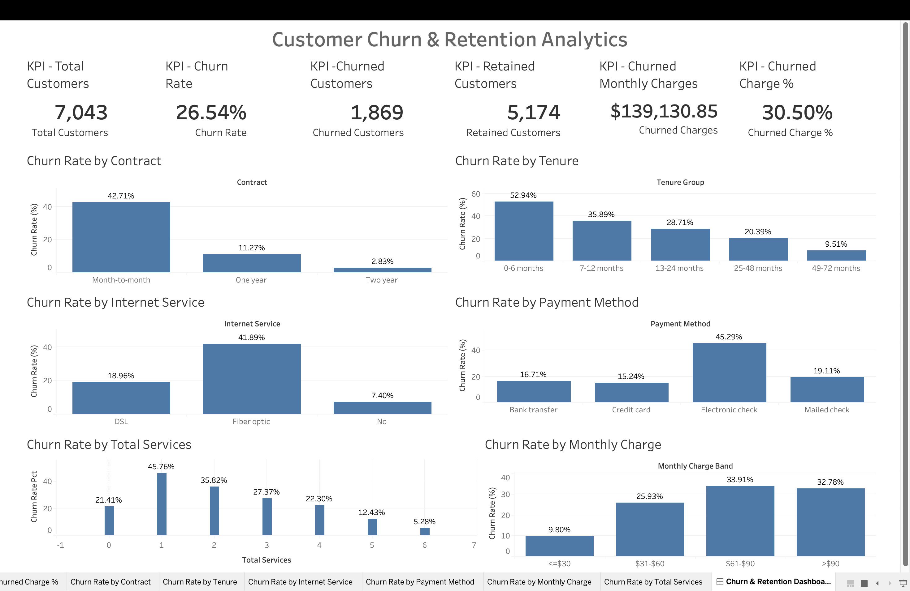

# Customer Churn & Retention Analytics

An end-to-end customer churn analysis project using Python, PostgreSQL, SQL, and Tableau.

## Project Overview

This project analyzes customer churn for a fictional telecommunications company using the IBM Telco Customer Churn dataset.

The analysis focuses on identifying customer groups associated with higher churn rates, examining customer tenure and service usage, and quantifying the monthly charge exposure associated with churned customers.

The project demonstrates a complete analytics workflow:

- Data quality assessment and cleaning using Python
- Feature engineering using pandas
- Data validation and exploratory analysis
- Relational data analysis using PostgreSQL
- Business-focused SQL analysis
- Interactive dashboard development using Tableau

## Live Dashboard

[View the interactive Tableau Public dashboard](https://public.tableau.com/app/profile/logesh.kanakaraj/viz/Customer_Churn_Retention_Analytics_17905993164320/ChurnRetentionDashboard)

## Business Questions

The analysis addresses the following questions:

- What is the overall customer churn rate?
- How does churn vary by contract type?
- How does churn vary across customer tenure groups?
- How does churn differ by internet service?
- How does payment method relate to churn?
- How does churn vary across monthly charge bands?
- How does the number of additional services relate to churn?
- How do contract type and tenure interact with churn?
- How much monthly charge exposure is associated with churned customers?
- Which churned customers have the highest monthly charges?

## Dataset

Source: IBM Telco Customer Churn sample dataset.

The raw dataset contains:

- 7,043 customers
- 21 columns
- Customer demographics
- Account information
- Services
- Contract details
- Payment methods
- Monthly and total charges
- Churn status

The dataset represents a fictional telecommunications customer base.

## Tools & Technologies

| Tool | Purpose |
|---|---|
| Python | Data cleaning, validation and feature engineering |
| pandas | Data manipulation and analysis |
| PostgreSQL | Data storage and SQL analysis |
| SQL | Business analysis and aggregation |
| Tableau | Interactive dashboard |
| Git & GitHub | Version control and portfolio presentation |

## Project Workflow

```text
Raw CSV
   ↓
Python Data Audit
   ↓
Data Cleaning
   ↓
Feature Engineering
   ↓
Cleaned CSV
   ↓
PostgreSQL
   ↓
SQL Analysis
   ↓
Tableau Dashboard

```

## Python Data Preparation

The notebook `notebooks/01_data_cleaning_feature_engineering.ipynb` performs the following:

### Data Quality Checks

- Inspected dataset dimensions and columns
- Checked data types
- Checked missing values
- Checked blank and whitespace values
- Checked duplicate rows
- Checked duplicate customer IDs
- Examined categorical values
- Validated numerical ranges
- Examined numerical correlations

### Data Cleaning

`TotalCharges` was initially stored as a string.

The analysis identified 11 blank/whitespace values. All 11 belonged to customers with zero months of tenure and no recorded churn.

These values were converted to numeric and assigned a value of `0` for customers with zero tenure.

The resulting analytical dataset contains:

- 7,043 customers
- 28 columns after feature engineering
- No remaining missing `TotalCharges` values

### Feature Engineering

The following analytical features were created:

- `TenureGroup`
- `MonthlyChargeBand`
- `TotalServices`
- `HasOnlineSecurity`
- `HasTechSupport`
- `HasStreaming`
- `IsAutomaticPayment`

`TotalServices` counts six additional services:

- Online Security
- Online Backup
- Device Protection
- Tech Support
- Streaming TV
- Streaming Movies

A `ChurnFlag` was also created for SQL analysis, where churned customers are represented by `1` and retained customers by `0`.

## PostgreSQL & SQL Analysis

The cleaned dataset was loaded into PostgreSQL using the `churn` schema and `customers` table.

The SQL analysis in `sql/churn_analysis.sql` includes:

1. Overall churn KPIs
2. Churn by contract type
3. Churn by tenure group
4. Churn by internet service
5. Churn by payment method
6. Churn by monthly charge band
7. Churn by number of services
8. Contract × tenure analysis
9. Highest monthly-charge churned customers
10. Monthly charge exposure from churned customers
11. Executive churn summary

## Key Findings

### Overall Churn

- Total customers: 7,043
- Churned customers: 1,869
- Retained customers: 5,174
- Overall churn rate: 26.54%

### Churn by Contract

| Contract | Customers | Churn Rate |
|---|---:|---:|
| Month-to-month | 3,875 | 42.71% |
| One year | 1,473 | 11.27% |
| Two year | 1,695 | 2.83% |

### Churn by Tenure

| Tenure | Churn Rate |
|---|---:|
| 0–6 months | 52.94% |
| 7–12 months | 35.89% |
| 13–24 months | 28.71% |
| 25–48 months | 20.39% |
| 49–72 months | 9.51% |

### Churn by Internet Service

| Internet Service | Churn Rate |
|---|---:|
| Fiber optic | 41.89% |
| DSL | 18.96% |
| No internet service | 7.40% |

### Churn by Payment Method

| Payment Method | Churn Rate |
|---|---:|
| Electronic check | 45.29% |
| Mailed check | 19.11% |
| Bank transfer (automatic) | 16.71% |
| Credit card (automatic) | 15.24% |

### Monthly Charge Exposure

Total monthly charges across the customer base were $456,116.60.

Customers who churned were associated with $139,130.85 in monthly charges, representing 30.50% of total monthly charge exposure.

This is a snapshot-based charge exposure measure rather than a forecast of future revenue loss.

## Tableau Dashboard

The Tableau dashboard provides an interactive overview of customer churn and retention patterns.

Dashboard sections include:

- Total Customers
- Churn Rate
- Churned Customers
- Retained Customers
- Churned Monthly Charges
- Churned Charge Exposure
- Churn Rate by Contract
- Churn Rate by Tenure
- Churn Rate by Internet Service
- Churn Rate by Payment Method
- Churn Rate by Monthly Charge
- Churn Rate by Total Services

### Dashboard Preview



## Project Structure

```text
Customer-Churn-Analytics/
│
├── dashboard/
│   ├── Customer_Churn_Retention_Analytics.twb
│   ├── dashboard_preview.png
│   └── data/
│       ├── churn_by_contract.csv
│       ├── churn_by_internet_service.csv
│       ├── churn_by_monthly_charge_band.csv
│       ├── churn_by_payment_method.csv
│       ├── churn_by_services.csv
│       ├── churn_by_tenure.csv
│       └── churn_kpis.csv
│
├── data/
│   ├── Telco-Customer-Churn.csv
│   └── telco_customer_churn_clean.csv
│
├── notebooks/
│   └── 01_data_cleaning_feature_engineering.ipynb
│
├── sql/
│   └── churn_analysis.sql
│
├── .gitignore
└── README.md